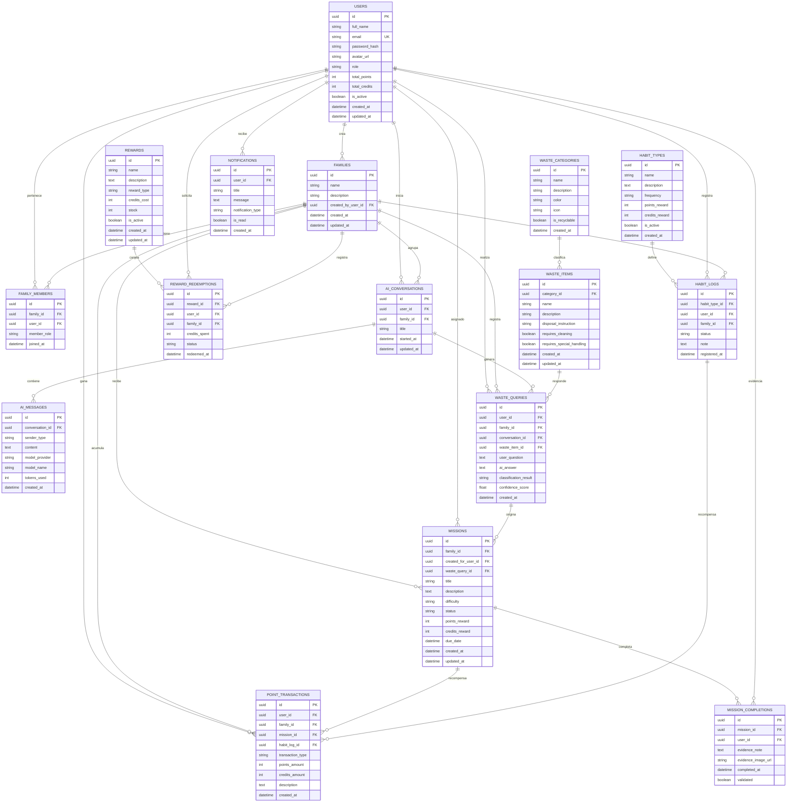

# Diagrama MER - EcoBuddy

Este documento contiene el **Modelo Entidad-Relación (MER)** propuesto para EcoBuddy, una aplicación móvil desarrollada en Flutter que funciona como asistente inteligente para reciclaje familiar, clasificación de residuos, generación de misiones, hábitos sostenibles, puntos, créditos y recompensas.

## Objetivo del modelo

El modelo busca representar las entidades principales necesarias para:

- Gestionar usuarios y familias.
- Registrar conversaciones con el asistente IA.
- Clasificar residuos consultados por los usuarios.
- Generar misiones domésticas a partir de consultas o hábitos.
- Registrar hábitos sostenibles del hogar.
- Administrar puntos, créditos y recompensas.
- Enviar notificaciones a los usuarios.

## Diagrama MER en Mermaid

## Descripción de entidades principales

### USERS

Representa a los usuarios registrados en la aplicación. Cada usuario puede pertenecer a una familia, iniciar conversaciones con la IA, completar misiones, registrar hábitos y canjear recompensas.

### FAMILIES

Representa el hogar o grupo familiar. Es importante porque EcoBuddy está orientado a mejorar los hábitos de reciclaje dentro del entorno familiar.

### FAMILY_MEMBERS

Tabla intermedia que permite relacionar usuarios con familias. También permite manejar roles dentro del hogar, por ejemplo: administrador, padre, madre, hijo o invitado.

### AI_CONVERSATIONS

Representa una conversación entre el usuario y el asistente IA. Sirve para agrupar los mensajes y mantener historial de consultas.

### AI_MESSAGES

Guarda los mensajes enviados por el usuario y las respuestas generadas por la IA. Permite auditar el historial conversacional y mejorar la experiencia del asistente.

### WASTE_CATEGORIES

Representa categorías de residuos, por ejemplo: plástico, papel, cartón, vidrio, orgánico, electrónico, peligroso o no reciclable.

### WASTE_ITEMS

Representa residuos específicos que pueden ser consultados por el usuario, por ejemplo: botella de plástico, caja de cartón, pila, bolsa, papel usado o lata.

### WASTE_QUERIES

Guarda cada consulta realizada por el usuario sobre un residuo. Relaciona la pregunta, la respuesta de IA, la clasificación obtenida y el residuo identificado.

### MISSIONS

Representa las misiones domésticas generadas por el sistema. Una misión puede nacer desde una consulta a la IA o desde una recomendación de hábito sostenible.

### MISSION_COMPLETIONS

Registra la finalización de una misión por parte del usuario. Puede guardar evidencia textual o imagen, además de un estado de validación.

### HABIT_TYPES

Define los tipos de hábitos sostenibles que el usuario puede registrar, por ejemplo: separar residuos, reducir plástico, reutilizar envases o limpiar materiales reciclables.

### HABIT_LOGS

Registra cada vez que un usuario cumple o reporta un hábito sostenible.

### POINT_TRANSACTIONS

Guarda el historial de puntos y créditos ganados o descontados. Es útil para mantener trazabilidad de la gamificación.

### REWARDS

Representa las recompensas disponibles para canjear con créditos.

### REWARD_REDEMPTIONS

Registra los canjes realizados por los usuarios.

### NOTIFICATIONS

Guarda notificaciones enviadas al usuario, como misiones pendientes, recompensas desbloqueadas o recordatorios de hábitos.

## Reglas generales del modelo

- Un usuario puede pertenecer a una o varias familias mediante `FAMILY_MEMBERS`.
- Una familia puede tener varios miembros.
- Un usuario puede iniciar varias conversaciones con la IA.
- Una conversación puede tener varios mensajes.
- Una consulta sobre residuo puede generar una misión.
- Una misión puede otorgar puntos y créditos al completarse.
- Un hábito registrado también puede generar puntos o créditos.
- Los créditos acumulados pueden ser usados para canjear recompensas.
- Las transacciones de puntos permiten auditar todo el sistema de gamificación.

## Observación técnica

Este MER está pensado para implementarse con **PostgreSQL** y un backend **NestJS** usando una arquitectura interna basada en módulos. Si se utiliza Prisma, cada entidad del diagrama puede convertirse en un modelo dentro de `schema.prisma`.
